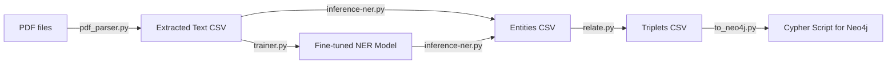
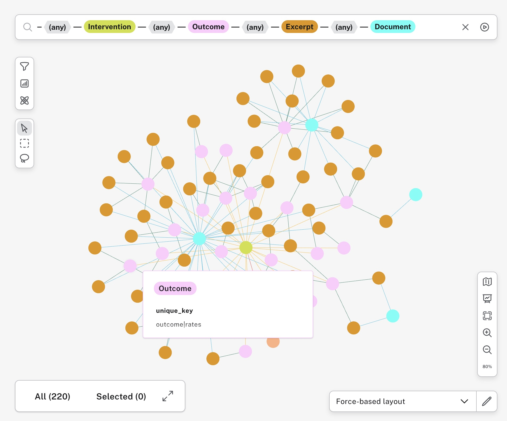
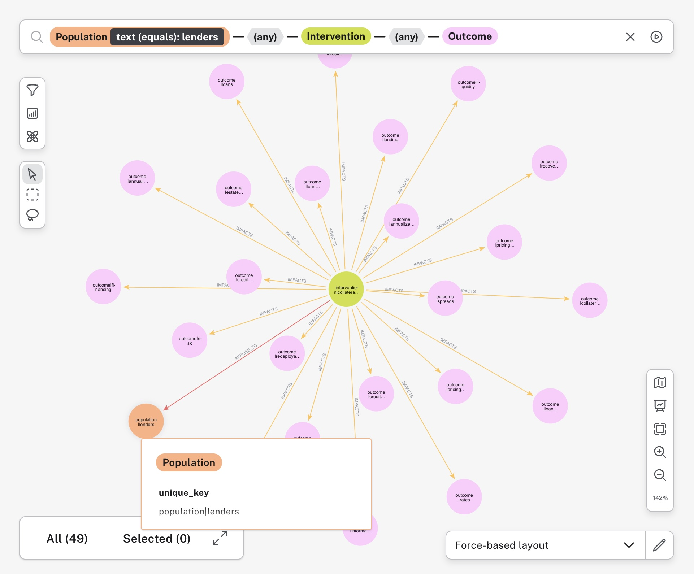

# Named Entity Recognition for Economic Research and Knowledge Graphs

Economic Research is a field that relies heavily on the analysis of large volumes of text data, such as news articles, financial reports, and social media posts. Named Entity Recognition (NER) is a crucial task in natural language processing (NLP) that involves identifying and classifying named entities in text into predefined categories such as persons, organizations, locations, dates, and monetary values. Beyond these standard categories, NER can also be used for more specialized entities relevant to economic research, such as capturing *efects in policy interventions* - this is particularly useful for government agencies, policy makers, and researchers who need to analyze the impact of various policies on economic outcomes.

This repository provides a collection of tools for performing NER on economic text data, with a focus on identifying *causal knowledge extraction* and *evidence based policy making*.

The goal is to offer a research, policy analyst, or government official a tool to quickly find relevant publications, excerpts, and evidence related to a specific economic intervention or policy question. The extracted entities can be used to build a set of relevant documents and excerpts which will assist in very quickly finding relevant evidence for further analysis.

The tool will allow answering questions such as:

- What interventions have been shown to impact a specific outcome (e.g., inflation, employment, poverty)?
- What populations are affected by a specific intervention (e.g., small businesses, low-income households)?
- What are the reported effects of a specific intervention on a given outcome (e.g., interest rate changes, tax policy changes)?
- What are the sources of evidence for a specific intervention and its effects (e.g., research papers, policy reports)?

## Models

Most encoder models for NER are based on transformer architectures, such as BERT, RoBERTa, and GPT. These models have been pre-trained on large corpora of text data and can be fine-tuned on specific NER tasks using labeled datasets. Some popular pre-trained models for NER include:

- **BERT (Bidirectional Encoder Representations from Transformers)**: BERT is a widely used transformer model that has been pre-trained on a large corpus of text data. It can be fine-tuned for NER tasks using labeled datasets such as CoNLL-2003 and OntoNotes 5.0.

- **RoBERTa (Robustly Optimized BERT Pretraining Approach)**: RoBERTa is an improved version of BERT that has been pre-trained on a larger corpus of text data and with different training techniques. It has shown better performance than BERT on various NLP tasks, including NER.

- **Deberta (Decoding-enhanced BERT with disentangled attention)**: DeBERTa is another variant of BERT that uses disentangled attention mechanisms to improve the model's ability to capture long-range dependencies in text. It has achieved state-of-the-art performance on several NLP benchmarks, including NER.

- **EconBERT**: EconBERT is a variant of BERT that has been specifically pre-trained on economic text data, such as financial news articles and research papers. It has shown promising results in NER tasks related to economic research.

- **EconBERTa**: EconBERTa is a variant of RoBERTa that has been pre-trained on economic text data. It has shown better performance than BERT and RoBERTa on NER tasks related to economic research.

There are also public datasets available for fine-tuning NER models for economic research, such as the [ECON-IE dataset](https://github.com/worldbank/econberta-econie), which contains annotated research papers in economics with entities related to policy interventions and their effects.

## The tooling

The processing pipeline consists of several steps, each handled by a specific component:



### PDF text extraction

The `pdf_parser.py` script extracts text blocks from PDF files in a specified directory. It uses heuristics to distinguish between content and headings, aiming to extract meaningful paragraphs while discarding titles and section numbers. The extracted text, along with metadata like file name and title, is saved to a CSV file for further processing.

Note that `pdf_parser.py` uses `spacy` for sentence segmentation, and you will need to download the English language model with the following command before running extraction:

```bash
spacy download en_core_web_sm
```

### Fine-tuning encoder models for NER

`trainer.py` is used to fine-tune a Hugging Face transformer model for Named Entity Recognition (NER) on a custom dataset. It takes a CoNLL-formatted text file as input, where tokens and their corresponding NER tags are defined. The script handles data loading, tokenization, alignment of labels, and the training process itself. After training, it saves the fine-tuned model and provides an evaluation on a test set.

For the purpose of causal knowledge extraction, this repository includes the ECON-IE NER training dataset in the `data/econ_ie` directory. You can use it to fine-tune models for this specific task.

For example, to fine-tune the `worldbank/econberta-fs` model with the ECON-IE annotation dataset, you can run the following command:

```bash
python trainer.py \
  --model_name worldbank/econberta-fs \
  --train_file data/econ_ie/train.conll \
  --validation_file data/econ_ie/dev.conll \
  --test_file data/econ_ie/test.conll \
  --output_dir econberta-fs-econ-ie-ner-tuned \
  --epochs 5
```

The trainer uses the `transformers` library from Hugging Face, and you can customize various parameters such as batch size, learning rate, and number of epochs through command-line arguments. It is capable of training on GPUs if available, and can leverage any CoNNL-formatted dataset for training encoder models for NER.

Note that for larger datasets, you will want to run fine-tuning on a GPU enabled backend (e.g., Google Colab, AWS SageMaker, Azure ML, etc), as training can be computationally intensive. Fine tuning EconBERTa on the ECON-IE dataset can be done on a GPU instance in a few minutes, but larger models and datasets will require more substantial compute resources (fine-tuning `worldbank/econberta-fs` with the ECON-IE dataset on a Macbook with MPS takes hours).

### Extracting entities

With a fine-tuned model available, `inference-ner.py` script is used to perform NER on a larger set of texts. It reads text from a specified column in a CSV file, runs the NER pipeline on each text, and appends the extracted entities as a new column in the output file. It allows setting a minimum confidence score to filter out less certain entities.

### Knowledge graph construction

This part of the toolchain converts the extracted entities into a knowledge graph. It's a two-step process:
1.  **`relate.py`**: This script reads the CSV file containing the entities and applies a set of rules to create relationships (triplets) between them. For example, it can link an `intervention` entity to an `outcome` entity with an "impacts" relationship. The resulting triplets are saved to a new CSV file.
2.  **`to_neo4j.py`**: This script takes the triplets CSV and generates a Cypher script. This script can be run in a Neo4j database to create the knowledge graph, including nodes for concepts and documents, and the relationships between them. It also sets up constraints and full-text search indexes for efficient querying.

## Classical encoder models for NER vs Large Language Models (LLMs)

When it comes to Named Entity Recognition (NER), and Knowledge Graph construction, both classical encoder models and Large Language Models (LLMs) have their strengths and weaknesses.

In general, classical encoder models, such as BERT-based models, are highly effective for NER tasks when they are fine-tuned on domain-specific datasets. They can achieve high accuracy and are efficient in terms of computational resources and cost (easily by an order of magnitude for datasets of any magnitude when compared to LLMs). Fine-tuning these models on a labeled dataset allows them to learn the specific characteristics of the entities relevant to the domain, leading to better performance.

LLMs, on the other hand, have shown remarkable capabilities in various NLP tasks, including NER. They can leverage their vast pre-trained knowledge to recognize entities even in contexts they haven't seen during training. However, LLMs can be computationally expensive to run and may require significant resources for fine-tuning, and can sometimes struggle with domain-specific entities if not properly adapted.

LLMs can also suffer from halluciations, where they generate entities that are not present in the text or are incorrect. This can be particularly problematic in policy, research, and economic contexts where accuracy and reliability are crucial. In contrast, classical encoder models, when fine-tuned on relevant datasets, tend to be more reliable in extracting accurate entities and therefore can be preferable when precision is more important than recall. Public cloud LLMs also raise concerns about data privacy and security, as sensitive information may be exposed during the processing of text data, while classical models can be deployed in a more controlled environment.

## Results

The combination of fine-tuned encoder models for NER and the knowledge graph construction pipeline has shown promising results in extracting causal relationships from economic texts. The resulting knowledge graphs can be used for various applications, such as policy analysis, economic research, and decision-making support.

For this example, we took a small set of [European Central Bank](https://www.ecb.europa.eu) publications, extracted the text, ran NER for outcomes, impacts, coreferences and populations using a fine-tuned EconBERTa model, and constructed a knowledge graph using the provided tooling. The resulting knowledge graph was imported into a Neo4j database for exploration.

With the resulting knowledge graph, we can quickly explore the knowledge graph to find all interventions, linked outcomes, excerpts and documents affecting a given population (e.g., "lenders"):



Or, we can explore interventions and outcomes related to the same population, to find relevant excerpt and documents which form the network of interrelated concepts:

